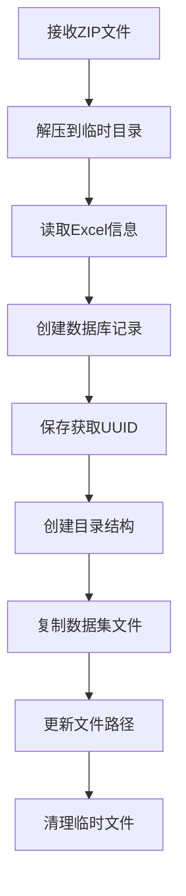

# 数据集管理系统技术文档

## 1. 系统概述

数据集管理系统是一个专门用于管理机器学习数据集的平台，提供完整的数据集生命周期管理功能。系统采用MVC架构设计，包含数据模型层、服务层和API路由层，实现了以下核心功能：

- 数据集包上传与解析
- 数据集信息存储与管理
- 数据集文件组织与管理
- 数据集的查询与检索
- 数据集的删除与资源清理
- 与模型评估系统的集成

系统支持多种类型数据集的管理，包括路径损耗数据、覆盖图数据和功率延时数据等，适用于无线通信领域的机器学习模型训练和验证。

## 2. 数据库结构

### 2.1 数据集基础信息表 (DatasetInfo)

```python
class DatasetInfo(db.Model):
    uuid = db.Column(db.String(37), primary_key=True, default=generate_dataset_uuid)
    dataset_type = db.Column(db.Integer, nullable=False, comment='数据集类型(1-3)')
    category = db.Column(db.String(50), nullable=False, comment='类别')
    scenario = db.Column(db.String(50), nullable=False, comment='场景')
    location = db.Column(db.String(100), nullable=False, comment='地点')
    center_frequency = db.Column(db.String(50), nullable=False, comment='中心频率')
    bandwidth = db.Column(db.String(50), nullable=False, comment='带宽')
    data_group_count = db.Column(db.String(50), nullable=False, comment='数据组数')
    applicable_models = db.Column(db.Text, nullable=False, comment='适用模型，多个模型用英文逗号分隔')
    updated_at = db.Column(db.DateTime, nullable=False, default=datetime.utcnow, 
                          onupdate=datetime.utcnow, comment='更新时间')
    detail = db.relationship('DatasetDetail', backref='dataset', uselist=False, 
                           cascade='all, delete-orphan', single_parent=True)
```

### 2.2 数据集详情表 (DatasetDetail)

```python
class DatasetDetail(db.Model):
    uuid = db.Column(db.String(50), primary_key=True, default=generate_detail_uuid)
    dataset_uuid = db.Column(db.String(37), db.ForeignKey('dataset_info.uuid', ondelete='CASCADE'), 
                           nullable=False, unique=True, comment='关联的数据集UUID')
    description = db.Column(db.Text, nullable=False, comment='数据介绍')
    detail_json = db.Column(db.Text, nullable=False, comment='详细信息，JSON格式存储')
    picture1_path = db.Column(db.String(255), comment='图片1路径')
    picture2_path = db.Column(db.String(255), comment='图片2路径')
    input_path = db.Column(db.String(255), comment='输入文件夹路径')
```

### 2.3 UUID生成机制

系统使用带前缀的UUID来区分不同类型的实体：

```python
# 数据集UUID生成（使用"DATASET-"前缀）
def generate_dataset_uuid():
    return f"DATASET-{uuid.uuid4().hex}"

# 数据集详情UUID生成（使用"DATASET_DETAIL-"前缀）
def generate_detail_uuid():
    return f"DATASET_DETAIL-{uuid.uuid4().hex}"
```

## 3. 文件系统结构

### 3.1 标准化目录结构

系统对每个数据集维护以下标准化的目录结构：

```
STORAGE_FOLDER/
└── DATASET_FOLDER/
    └── <dataset_uuid>/
        ├── picture1/       # 存储场景图片
        ├── picture2/       # 存储附加图片
        ├── input/          # 存储输入数据文件
        └── satellite/      # 存储卫星图片数据（可选）
```

### 3.2 配置参数

参看config.py

## 4. 数据集上传机制

### 4.1 上传包结构要求

数据集上传ZIP包必须遵循以下结构：

```
dataset_upload.zip/
├── dataset_information.xlsx  # 数据集元信息Excel文件
├── picture1/                 # 场景图片文件夹
├── picture2/                 # 附加图片文件夹
├── input/                    # 输入数据文件夹
└── satellite/                # 卫星图片数据文件夹（可选）
```

### 4.2 Excel文件结构要求

`dataset_information.xlsx`必须包含以下字段：

| 字段名     | 值类型      | 说明                                    |
| ---------- | ----------- | --------------------------------------- |
| 数据集类型 | 整数(1-3)   | 1:路径损耗, 2:覆盖图, 3:功率延时        |
| 类别       | 字符串      | 数据集类别描述                          |
| 场景       | 字符串      | 场景描述，如"城市"、"郊区"等            |
| 地点       | 字符串      | 具体位置描述                            |
| 中心频率   | 字符串/数字 | 测量的中心频率                          |
| 带宽       | 字符串/数字 | 测量的带宽                              |
| 数据组数   | 字符串/数字 | 数据集包含的组数                        |
| 适用模型   | 字符串      | 逗号分隔的适用模型列表                  |
| 数据介绍   | 字符串      | 数据集的详细描述                        |
| 测量日期   | 日期        | 数据收集的日期                          |
| [其他字段] | 任意        | 其他元数据信息（将保存在detail_json中） |

### 4.3 上传处理流程



### 4.4 日期处理机制

系统能够处理多种日期格式：

```python
# 处理日期类型
if field_name in date_fields:
    if pd.isna(value):
        value = datetime.now()  # 如果日期为空，使用当前时间
    elif isinstance(value, (int, float)):
        # 如果是Excel序列号，转换为datetime
        value = pd.Timestamp.fromordinal(int(value) + 693594).strftime('%Y年%m月%d日')
    elif isinstance(value, str):
        # 如果是字符串，尝试解析
        try:
            value = datetime.strptime(value, '%Y年%m月%d日').strftime('%Y年%m月%d日')
        except:
            value = str(value)
```

## 5. 服务层功能

### 5.1 数据集列表查询

支持分页和多种搜索条件：

```python
def get_dataset_list(page=1, per_page=10, search_type=None, search_term=None):
    # 创建基础查询
    query = DatasetInfo.query
    
    # 使用搜索策略模式应用搜索条件
    if search_type and search_term:
        strategy = search_factory.get_strategy(f"dataset_{search_type}")
        query = strategy.apply(query, search_term)
    
    # 应用排序
    query = query.order_by(DatasetInfo.updated_at.desc())
    
    # 执行分页查询
    pagination = query.paginate(page=page, per_page=per_page, error_out=False)
    
    # 返回标准化的分页结果
    return {
        'total': pagination.total,
        'pages': pagination.pages,
        'current_page': pagination.page,
        'per_page': pagination.per_page,
        'items': [item.to_dict() for item in pagination.items],
        'search_types': [name.replace('dataset_', '') for name in 
                       search_factory.get_all_strategy_names() 
                       if name.startswith('dataset_')]
    }
```

### 5.2 数据集详情查询

```python
def get_dataset_detail(dataset_uuid):
    # 获取数据集基础信息
    dataset = DatasetInfo.query.get_or_404(dataset_uuid)
    dataset_dict = dataset.to_dict()
    
    # 获取数据集详情
    if dataset.detail:
        dataset_dict['detail'] = dataset.detail.to_dict()
    else:
        dataset_dict['detail'] = None
        
    return dataset_dict
```

### 5.3 使用状态检查

在删除前检查数据集是否正在被评估任务使用：

```python
def check_dataset_in_use(dataset_uuid):
    # 查询是否有进行中的验证任务使用了该数据集
    in_use = EvaluateInfo.query.filter_by(
        dataset_uuid=dataset_uuid,
        evaluate_status=EvaluateStatusType.IN_PROGRESS.value
    ).first() is not None
    
    if in_use:
        return True, "该数据集正在被验证任务使用，无法删除"
    return False, ""
```

### 5.4 数据集删除与资源清理

包含使用中检查和文件资源清理：

```python
def delete_dataset(dataset_uuid):
    # 检查数据集是否在使用中
    in_use, error_msg = DatasetService.check_dataset_in_use(dataset_uuid)
    if in_use:
        raise ValueError(error_msg)
        
    try:
        # 获取数据集信息
        dataset = DatasetInfo.query.get_or_404(dataset_uuid)
        
        # 如果存在详情，先删除相关文件
        if dataset.detail:
            dataset.detail.delete_files()
        
        # 删除数据库记录（级联删除会自动删除详情记录）
        db.session.delete(dataset)
        db.session.commit()
        
        return True
    except Exception as e:
        db.session.rollback()
        raise e
```

### 5.5 文件清理实现

处理不同操作系统的文件删除差异：

```python
def delete_files(self):
    dataset_folder = get_dataset_folder_path(self.dataset_uuid)
    if not os.path.exists(dataset_folder):
        return
        
    try:
        # 首先尝试使用shutil.rmtree删除
        shutil.rmtree(dataset_folder, ignore_errors=True)
        
        # 检查文件夹是否还存在
        if os.path.exists(dataset_folder):
            # 如果还存在，使用系统命令强制删除
            if platform.system() == 'Windows':
                # Windows系统使用rd命令
                subprocess.run(['rd', '/s', '/q', dataset_folder], 
                            shell=True, 
                            check=False,
                            capture_output=True)
            else:
                # Linux/Unix系统使用rm命令
                subprocess.run(['rm', '-rf', dataset_folder], 
                            shell=False, 
                            check=False,
                            capture_output=True)
    except Exception as e:
        current_app.logger.error(
            f"删除文件夹 {dataset_folder} 时发生错误: {str(e)}"
        )
```

## 6. API接口规范

### 6.1 数据集上传接口

```
POST /dataset/upload
Content-Type: multipart/form-data

参数:
- dataset_package: 数据集ZIP包文件

成功响应: (200 OK)
{
  "code": 200,
  "message": "数据集上传成功",
  "data": {
    "dataset_uuid": "DATASET-abcdef1234567890"
  }
}

错误响应: (400/500)
{
  "code": 400或500,
  "message": "错误信息",
  "data": null
}
```

### 6.2 数据集列表接口

```
GET /dataset/list?page=1&per_page=10&search_type=category&search_term=城市

参数:
- page: 页码，默认1
- per_page: 每页条数，默认10
- search_type: 搜索类型（可选）
- search_term: 搜索关键词（可选）

成功响应: (200 OK)
{
  "code": 200,
  "message": "获取成功",
  "data": {
    "total": 100,
    "pages": 10,
    "current_page": 1,
    "per_page": 10,
    "items": [
      {
        "uuid": "DATASET-abcdef1234567890",
        "dataset_type": 1,
        "category": "城市",
        "scenario": "高楼",
        "location": "北京市海淀区",
        ...
      },
      ...
    ],
    "search_types": ["category", "scenario", "location"]
  }
}
```

### 6.3 数据集详情接口

```
GET /dataset/<dataset_uuid>

成功响应: (200 OK)
{
  "code": 200,
  "message": "获取成功",
  "data": {
    "uuid": "DATASET-abcdef1234567890",
    "dataset_type": 1,
    "category": "城市",
    ...
    "detail": {
      "uuid": "DATASET_DETAIL-1234567890abcdef",
      "description": "数据集介绍",
      "detail_json": "{\"测量日期\":\"2023年5月15日\", ...}",
      "picture1_path": "datasets/DATASET-abcdef1234567890/picture1/image.png",
      ...
    }
  }
}
```

### 6.4 数据集删除接口

```
DELETE /dataset/<dataset_uuid>

成功响应: (200 OK)
{
  "code": 200,
  "message": "删除成功",
  "data": null
}

错误响应:
{
  "code": 500,
  "message": "删除数据集失败：该数据集正在被验证任务使用，无法删除",
  "data": null
}
```

## 7. 安全解压器集成

数据集上传过程中使用`SafeExtractor`确保多线程安全解压：

```python
# 解压文件
extractor = SafeExtractor(zip_file_path, temp_extract_path)
if not extractor.extract_all():
    raise Exception("数据集解压失败")
```

## 8. JSON处理机制

系统使用JSON格式存储额外的数据集属性信息：

```python
# 创建数据集详情记录
dataset_detail = DatasetDetail(
    description=dataset_info['数据介绍'],
    detail_json=json.dumps(dataset_info['details'], ensure_ascii=False)
)
```

客户端可以解析`detail_json`字段获取额外属性：

```javascript
// 客户端示例代码
const datasetDetail = response.data.detail;
const additionalInfo = JSON.parse(datasetDetail.detail_json);
console.log('测量日期:', additionalInfo['测量日期']);
```

## 9. 错误处理与异常管理

### 9.1 事务管理

所有数据库操作使用事务包装，确保原子性：

```python
try:
    # 数据库操作
    db.session.add(dataset)
    db.session.commit()
except Exception as e:
    db.session.rollback()
    # 清理已创建的资源
    raise e
```

### 9.2 资源清理机制

使用finally块确保临时资源清理：

```python
try:
    # 处理逻辑
except Exception as e:
    # 错误处理
    raise e
finally:
    # 清理临时文件
    if os.path.exists(temp_extract_path):
        shutil.rmtree(temp_extract_path, ignore_errors=True)
```

### 9.3 服务器统一响应格式

使用`ServerResponse`确保API返回格式一致：

```python
return jsonify(
    ServerResponse.success(
        data={'dataset_uuid': dataset_uuid},
        message='数据集上传成功'
    ).model_dump()
), HTTPStatus.OK.value

# 错误响应
return jsonify(
    ServerResponse.error(
        f"数据集上传失败：{str(e)}", 
        HTTPStatus.INTERNAL_SERVER_ERROR.value
    ).model_dump()
), HTTPStatus.INTERNAL_SERVER_ERROR.value
```

## 10. 实际使用流程

### 10.1 数据集准备流程

1. 准备符合结构的数据集（输入数据、场景图片等）
2. 创建`dataset_information.xlsx`填写元数据
3. 按照规定结构组织文件夹
4. 打包为ZIP文件

### 10.2 数据集上传流程

1. 调用`POST /dataset/upload`接口上传数据集ZIP包
2. 系统解压、解析Excel信息、创建数据库记录
3. 将数据集文件组织到标准化目录结构
4. 返回`dataset_uuid`供后续操作使用

### 10.3 数据集查询流程

1. 调用`GET /dataset/list`接口获取数据集列表
2. 可选使用分页参数和搜索条件过滤
3. 调用`GET /dataset/<dataset_uuid>`获取特定数据集详情

### 10.4 数据集删除流程

1. 调用`DELETE /dataset/<dataset_uuid>`请求删除特定数据集
2. 系统检查数据集是否在使用中（有运行中的评估任务）
3. 如未使用，删除文件系统资源和数据库记录
4. 如在使用中，返回错误信息

## 11. 技术依赖与版本要求

- **Python**: 3.6+
- **Flask**: 2.0.0+
- **SQLAlchemy**: 1.4.0+
- **Pandas**: 1.0.0+，用于Excel解析
- **Pydantic**: 1.8.0+，用于请求/响应验证
- **依赖Python模块**:
  - `os`, `shutil`, `platform`
  - `subprocess`, `datetime`, `uuid`
  - `json`（用于处理额外属性）

## 12. 注意事项与限制

1. **Excel格式要求严格**: 数据集信息Excel必须包含所有规定字段，且列名必须为"字段名"和"值"
2. **文件结构限制**: 上传包必须包含规定的文件夹结构
3. **数据集唯一性**: 每个数据集在系统中必须使用唯一UUID标识
4. **数据集删除限制**: 正在被评估任务使用的数据集无法删除
5. **文件路径长度限制**: 存储路径不应超过操作系统限制（Windows: 260字符）
6. **存储空间管理**: 应定期监控存储空间使用情况，防止磁盘空间耗尽