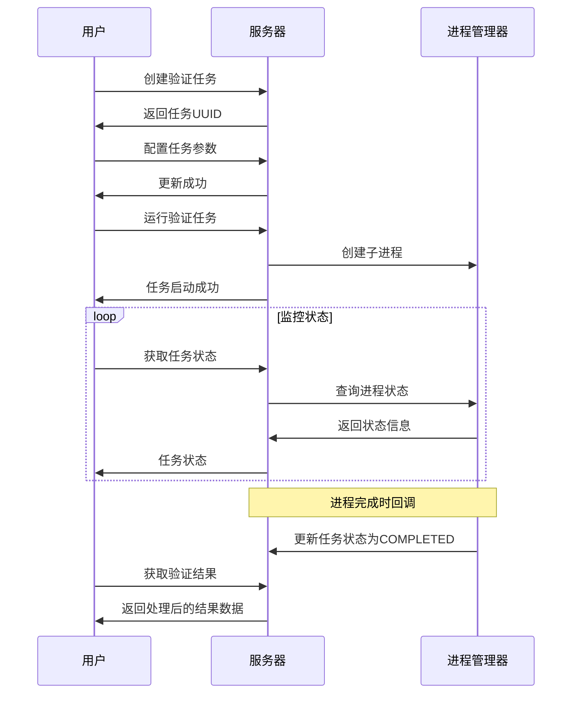
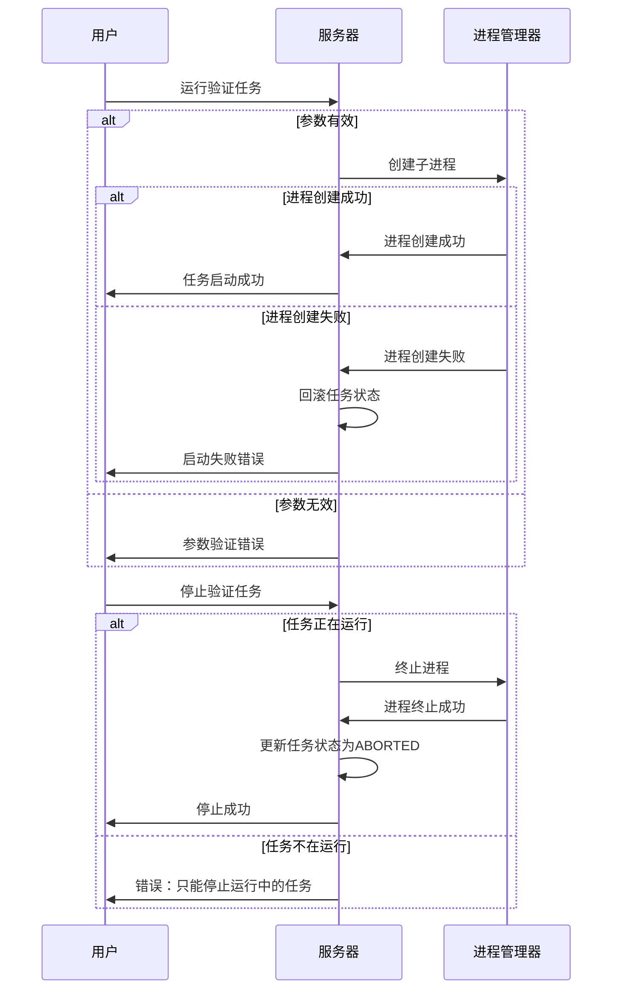

# 验证任务系统技术文档

## 1. 系统概述

验证任务系统是一个专门用于管理和执行机器学习模型评估的完整平台，支持不同类型的模型验证任务。系统采用MVC架构设计，实现了以下核心功能：

- 验证任务的创建、配置与管理
- 异步进程的调度与监控
- 多种验证类型（1-4）的支持
- 结果数据的解析与可视化
- 任务状态的全生命周期管理
- 与模型系统和数据集系统的集成

系统设计中特别关注了进程管理、异常容错、资源清理和大文件处理等关键技术问题，确保在实际应用场景中的稳定性和可靠性。

## 2. 数据模型

### 2.1 验证任务表 (EvaluateInfo)

```python
class EvaluateInfo(db.Model):
    uuid = db.Column(db.String(37), primary_key=True, default=generate_evaluate_uuid)
    evaluate_type = db.Column(db.Integer, nullable=False, comment='验证任务类型(1-4)')
    model_uuid = db.Column(db.String(37), db.ForeignKey('model_info.uuid', ondelete='SET NULL'), 
                         nullable=True, comment='关联的模型UUID')
    dataset_uuid = db.Column(db.String(37), db.ForeignKey('dataset_info.uuid', ondelete='SET NULL'), 
                           nullable=True, comment='关联的数据集UUID')
    evaluate_status = db.Column(db.String(20), nullable=False, 
                              default=EvaluateStatusType.NOT_STARTED.value, comment='验证任务状态')
    start_time = db.Column(db.DateTime, nullable=False, comment='任务开始时间')
    end_time = db.Column(db.DateTime, nullable=True, comment='任务结束时间')
    extra_parameter = db.Column(db.Text, nullable=True, comment='额外参数')
```

### 2.2 验证任务状态类型

```python
class EvaluateStatusType(Enum):
    NOT_STARTED = 'NOT_STARTED'  # 未开始
    IN_PROGRESS = 'IN_PROGRESS'  # 进行中
    COMPLETED = 'COMPLETED'      # 已完成
    ABORTED = 'ABORTED'          # 已中止
```

### 2.3 UUID生成机制

系统使用带前缀的UUID标识验证任务：

```python
def generate_evaluate_uuid():
    return f"EVALUATE-{uuid.uuid4().hex}"
```

### 2.4 验证任务类型

系统支持四种不同类型的验证任务：

1. **类型1（路径损耗预测）**：处理单值序列数据，输出measure/predict/rmse列表
2. **类型2（覆盖图生成）**：处理二维矩阵数据，输出elevation_matrix和pl_matrix
3. **类型3（功率延时预测）**：处理四种图像数据，输出left_up/down和right_up/down图像路径
4. **类型4（多点传播预测）**：处理三种关联图像，输出pdp/pl/sf图像路径

## 3. 文件系统结构

### 3.1 标准化目录结构

系统对每个验证任务维护以下标准化的目录结构：

```
STORAGE_FOLDER/
└── EVALUATE_FOLDER/
    └── <evaluate_uuid>/
        └── EVALUATE_OUTPUT_FOLDER/
            ├── pathloss_result.csv                    # 类型1输出
            ├── elevation_output/                      # 类型2输出目录1
            │   └── <index>_elevation.csv
            ├── pl_output/                             # 类型2输出目录2
            │   └── <index>_path_loss.csv
            ├── left_up/                               # 类型3输出目录1
            ├── left_down/                             # 类型3输出目录2
            ├── right_up/                              # 类型3输出目录3
            │   └── gen_0_<index>_pdp.png
            ├── right_down/                            # 类型3输出目录4
            │   └── gen_1_<index>_pdp.png
            ├── pdp/                                   # 类型4输出目录1
            │   └── 3d_surface_plot_<index>.png
            ├── pl/                                    # 类型4输出目录2
            │   └── pl_<index>.png
            └── sf/                                    # 类型4输出目录3
                └── sf_<index>.png
```

### 3.2 配置参数

参看config.py

## 4. 服务层功能

### 4.1 验证任务创建

```python
def create_evaluate(evaluate_type=1, model_uuid=None, dataset_uuid=None, extra_parameter=None):
    """创建新的验证任务"""
    # 验证任务类型和关联实体
    # 创建验证任务对象
    evaluate = EvaluateInfo(
        evaluate_type=evaluate_type,
        model_uuid=model_uuid,
        dataset_uuid=dataset_uuid,
        extra_parameter=extra_parameter,
        evaluate_status=EvaluateStatusType.NOT_STARTED.value,
        start_time=datetime.utcnow()
    )
    
    # 保存并创建文件夹
    db.session.add(evaluate)
    db.session.commit()
    evaluate.ensure_folders()
    
    return evaluate.to_dict()
```

### 4.2 验证任务运行

```python
def run_evaluate(evaluate_uuid):
    """运行验证任务"""
    # 获取验证任务、模型和数据集
    evaluate = EvaluateInfo.query.get_or_404(evaluate_uuid)
    model_detail = ModelDetail.query.filter_by(model_uuid=evaluate.model_uuid).first()
    
    # 获取Python解释器、脚本路径、输入输出目录
    python_exe = os.path.join(
        current_app.config['STORAGE_FOLDER'],
        model_detail.env_file_path,
        'python.exe'
    )
    script_path = os.path.join(
        current_app.config['STORAGE_FOLDER'],
        model_detail.code_file_path
    )
    
    # 构建命令和环境
    cmd = [python_exe, script_path, input_dir, output_dir]
    if evaluate.extra_parameter:
        cmd.append(evaluate.extra_parameter)
    
    # 更新任务状态
    evaluate.evaluate_status = EvaluateStatusType.IN_PROGRESS.value
    db.session.commit()
    
    # 启动进程
    process_manager = ProcessManager()
    return process_manager.start_process(
        evaluate.uuid, cmd, work_dir, env, 
        EvaluateService._on_process_complete
    )
```

### 4.3 进程回调处理

```python
@classmethod
def _on_process_complete(cls, process_id, return_code):
    """进程结束时的回调函数"""
    app = cls._get_app()
    with app.app_context():
        # 获取验证任务
        evaluate = EvaluateInfo.query.get(process_id)
        if evaluate:
            # 根据返回码设置状态
            if return_code == 0:
                evaluate.evaluate_status = EvaluateStatusType.COMPLETED.value
            else:
                evaluate.evaluate_status = EvaluateStatusType.ABORTED.value
            # 设置结束时间
            evaluate.end_time = datetime.utcnow()
            db.session.commit()
```

### 4.4 进程状态查询

```python
@classmethod
def get_process_status(cls, evaluate_uuid):
    """获取验证任务进程状态"""
    # 获取验证任务
    evaluate = EvaluateInfo.query.get_or_404(evaluate_uuid)
    
    # 获取进程状态
    status = cls._process_manager.get_process_status(evaluate_uuid)
    if status is None:
        return {
            'evaluate_uuid': evaluate_uuid,
            'evaluate_status': evaluate.evaluate_status,
            'start_time': evaluate.start_time.isoformat() if evaluate.start_time else None,
            'end_time': evaluate.end_time.isoformat() if evaluate.end_time else None,
            'message': '进程不存在'
        }
    
    return status
```

### 4.5 任务停止

```python
@classmethod
def stop_process(cls, evaluate_uuid):
    """停止验证任务进程"""
    # 获取验证任务
    evaluate = EvaluateInfo.query.get_or_404(evaluate_uuid)
    
    # 检查任务状态
    if evaluate.evaluate_status != EvaluateStatusType.IN_PROGRESS.value:
        raise ValueError("只能停止正在进行中的任务")
    
    # 停止进程
    process_stopped = cls._process_manager.stop_process(evaluate_uuid)
    
    # 更新任务状态
    evaluate.evaluate_status = EvaluateStatusType.ABORTED.value
    evaluate.end_time = datetime.utcnow()
    db.session.commit()
    
    return process_stopped
```

## 5. 结果处理机制

### 5.1 结果处理路由选择

```python
def get_evaluate_latest_result(evaluate_uuid, index=None):
    """获取验证任务的最新结果"""
    # 获取验证任务信息
    evaluate = EvaluateInfo.query.get_or_404(evaluate_uuid)
    
    # 根据验证任务类型调用不同的处理方法
    if evaluate.evaluate_type == 1:
        return EvaluateResultService._process_type1_result(evaluate, index)
    elif evaluate.evaluate_type == 2:
        return EvaluateResultService._process_type2_result(evaluate, index)
    elif evaluate.evaluate_type == 3:
        return EvaluateResultService._process_type3_result(evaluate, index)
    elif evaluate.evaluate_type == 4:
        return EvaluateResultService._process_type4_result(evaluate, index)
    return {}
```

### 5.2 类型1结果处理（路径损耗预测）

```python
def _process_type1_result(evaluate, index=None):
    """处理类型1的验证结果"""
    result = {
        'measure': [],
        'predict': [],
        'rmse': [],
        'satellite_path': None,
        'current_index': 0,
        'latest_index': 0
    }
    
    # 读取CSV文件
    output_file = os.path.join(
        current_app.config['STORAGE_FOLDER'],
        current_app.config['EVALUATE_FOLDER'],
        evaluate.uuid,
        current_app.config['EVALUATE_OUTPUT_FOLDER'],
        'pathloss_result.csv'
    )
    
    # 解析CSV数据
    df = pd.read_csv(output_file, header=None, names=['measure', 'predict', 'rmse'])
    
    # 提取数据序列
    result['measure'] = df['measure'].iloc[:target_index+1].tolist()
    result['predict'] = df['predict'].iloc[:target_index+1].tolist()
    result['rmse'] = df['rmse'].iloc[:target_index+1].tolist()
    
    # 关联卫星图片
    if evaluate.dataset_uuid:
        satellite_path = os.path.join(
            current_app.config['DATASET_FOLDER'],
            evaluate.dataset_uuid,
            'satellite',
            f'{target_index}.png'
        )
        if os.path.exists(os.path.join(current_app.config['STORAGE_FOLDER'], satellite_path)):
            result['satellite_path'] = satellite_path
    
    return result
```

### 5.3 类型2结果处理（覆盖图生成）

```python
def _process_type2_result(evaluate, index=None):
    """处理类型2的验证结果"""
    result = {
        'elevation_matrix': [],
        'pl_matrix': [],
        'satellite_path': None,
        'current_index': 0,
        'latest_index': 0
    }
    
    # 获取目录路径
    output_dir = os.path.join(
        current_app.config['STORAGE_FOLDER'],
        current_app.config['EVALUATE_FOLDER'],
        evaluate.uuid,
        current_app.config['EVALUATE_OUTPUT_FOLDER']
    )
    elevation_dir = os.path.join(output_dir, 'elevation_output')
    pl_dir = os.path.join(output_dir, 'pl_output')
    
    # 查找文件并按索引排序
    elevation_files = [f for f in os.listdir(elevation_dir) 
                     if f.endswith('_elevation.csv')]
    file_indices = []
    for file in elevation_files:
        match = re.search(r'.*?(\d+)_elevation\.csv$', file)
        if match:
            file_indices.append((int(match.group(1)), file))
    file_indices.sort(key=lambda x: x[0])
    
    # 读取矩阵数据
    elevation_data = df_elevation.values.tolist()
    pl_data = df_pl.values.tolist()
    
    # 设置结果
    result['elevation_matrix'] = elevation_data
    result['pl_matrix'] = pl_data
    
    return result
```

### 5.4 重试机制

系统实现了CSV文件读取的重试机制，处理可能出现的文件锁定或I/O竞争问题：

```python
# 读取CSV文件，最多重试3次
max_retries = 3
retry_count = 0
df = None

while retry_count < max_retries:
    try:
        df = pd.read_csv(output_file, header=None, names=['measure', 'predict', 'rmse'])
        if not df.empty:
            break
    except Exception as e:
        current_app.logger.warning(f"第{retry_count + 1}次读取CSV文件失败: {str(e)}")
        retry_count += 1
        if retry_count < max_retries:
            time.sleep(0.3)  # 等待0.3秒后重试
```

## 6. API接口规范

### 6.1 创建验证任务

```
POST /evaluate/create
Content-Type: application/json

请求体:
{
  "evaluate_type": 1,              // 验证任务类型(1-4)
  "model_uuid": "MODEL-xxx...",    // 关联的模型UUID
  "dataset_uuid": "DATASET-xxx...", // 关联的数据集UUID
  "extra_parameter": "param"       // 额外参数
}

成功响应: (200 OK)
{
  "code": 200,
  "message": "创建成功",
  "data": {
    "uuid": "EVALUATE-abcdef1234567890",
    "evaluate_type": 1,
    "model_uuid": "MODEL-xxx...",
    ...
  }
}
```

### 6.2 获取验证任务列表

```
GET /evaluate/list?page=1&per_page=10&search_type=model&search_term=xxx

参数:
- page: 页码，默认1
- per_page: 每页条数，默认10
- search_type: 搜索类型（可选）
- search_term: 搜索关键词（可选）

成功响应: (200 OK)
{
  "code": 200,
  "message": "获取成功",
  "data": {
    "total": 100,
    "pages": 10,
    "current_page": 1,
    "per_page": 10,
    "items": [
      {
        "uuid": "EVALUATE-abcdef1234567890",
        "evaluate_type": 1,
        "model_uuid": "MODEL-xxx...",
        "model_name": "模型名称",
        "dataset_uuid": "DATASET-xxx...",
        "dataset_name": "[城市高楼]-北京海淀",
        ...
      },
      ...
    ],
    "search_types": ["model", "dataset", "status"]
  }
}
```

### 6.3 获取验证任务详情

```
GET /evaluate/<evaluate_uuid>

成功响应: (200 OK)
{
  "code": 200,
  "message": "获取成功",
  "data": {
    "uuid": "EVALUATE-abcdef1234567890",
    "evaluate_type": 1,
    "model_uuid": "MODEL-xxx...",
    "model_name": "模型名称",
    "dataset_uuid": "DATASET-xxx...",
    "dataset_name": "[城市高楼]-北京海淀",
    "evaluate_status": "COMPLETED",
    "start_time": "2023-01-01T12:00:00",
    "end_time": "2023-01-01T12:05:30",
    "extra_parameter": "param"
  }
}
```

### 6.4 运行验证任务

```
POST /evaluate/<evaluate_uuid>/run

成功响应: (200 OK)
{
  "code": 200,
  "message": "任务启动成功",
  "data": {
    "process_id": "EVALUATE-abcdef1234567890",
    "message": "验证任务已启动",
    "running_count": 1,
    "max_processes": 5
  }
}
```

### 6.5 获取验证任务进程状态

```
GET /evaluate/<evaluate_uuid>/status

成功响应: (200 OK)
{
  "code": 200,
  "message": "获取成功",
  "data": {
    "process_id": "EVALUATE-abcdef1234567890",
    "status": "running",
    "start_time": "2023-01-01T12:00:00",
    "return_code": null,
    "stdout": "处理中...\n进度: 50%",
    "stderr": "",
    "running_count": 1,
    "max_processes": 5
  }
}
```

### 6.6 停止验证任务

```
POST /evaluate/<evaluate_uuid>/stop

成功响应: (200 OK)
{
  "code": 200,
  "message": "停止成功",
  "data": null
}
```

### 6.7 获取验证任务结果

```
GET /evaluate/<evaluate_uuid>/result?index=5

参数:
- index: 可选参数，指定要获取数据的序号（从0开始）

成功响应: (200 OK)
{
  "code": 200,
  "message": "获取成功",
  "data": {
    // 类型1结果示例
    "measure": [120.5, 122.3, 118.7, ...],
    "predict": [121.2, 123.1, 117.9, ...],
    "rmse": [0.7, 0.8, 0.8, ...],
    "satellite_path": "datasets/DATASET-xxx/satellite/5.png",
    "current_index": 5,
    "latest_index": 10
  }
}
```

## 7. 进程管理机制

验证任务系统使用ProcessManager处理异步任务执行，具有以下特点：

### 7.1 并发控制

```python
# 检查是否达到最大进程数
if self.get_running_process_count() >= self.get_max_processes():
    return False
```

### 7.2 输出捕获

```python
# 创建进程
process = subprocess.Popen(
    cmd,
    cwd=cwd,
    env=env,
    stdout=subprocess.PIPE,
    stderr=subprocess.PIPE,
    text=True,
    bufsize=1
)

# 创建输出队列
stdout_queue = queue.Queue()
stderr_queue = queue.Queue()

# 启动输出读取线程
stdout_thread = threading.Thread(
    target=self._read_output,
    args=(process.stdout, stdout_queue),
    daemon=True
)
stderr_thread = threading.Thread(
    target=self._read_output,
    args=(process.stderr, stderr_queue),
    daemon=True
)
```

### 7.3 进程监控

```python
def _monitor_process(self, process_id):
    """监控进程状态的线程函数"""
    def monitor():
        process_info = self.processes[process_id]
        process = process_info['process']
        
        # 等待进程结束
        process.wait()
        
        # 更新进程状态
        process_info['status'] = 'completed'
        process_info['end_time'] = datetime.now()
        
        # 调用回调函数
        if process_info.get('on_complete'):
            process_info['on_complete'](process_id, process.returncode)
    
    thread = threading.Thread(target=monitor)
    thread.daemon = True
    thread.start()
```

## 8. 错误处理与容错机制

### 8.1 数据库事务管理

系统在所有数据库操作中采用事务包装，确保数据一致性：

```python
try:
    # 数据库操作
    db.session.add(evaluate)
    db.session.commit()
except Exception as e:
    db.session.rollback()
    raise e
```

### 8.2 进程状态恢复

当进程启动失败时，系统会自动恢复任务状态：

```python
try:
    # 启动进程
    if process_manager.start_process(...):
        return {"message": "验证任务已启动"}
    else:
        # 恢复任务状态
        evaluate.evaluate_status = EvaluateStatusType.NOT_STARTED.value
        db.session.commit()
        raise RuntimeError("启动验证任务失败")
except Exception as e:
    # 恢复任务状态
    if 'evaluate' in locals():
        evaluate.evaluate_status = EvaluateStatusType.NOT_STARTED.value
        db.session.commit()
    raise e
```

### 8.3 文件操作容错

系统在处理文件时实现了多种容错机制：

```python
# 检查文件是否存在
if not os.path.exists(output_file):
    return result
    
# 尝试读取文件，支持重试
max_retries = 3
retry_count = 0
while retry_count < max_retries:
    try:
        df = pd.read_csv(output_file, header=None, names=['measure', 'predict', 'rmse'])
        if not df.empty:
            break
    except Exception as e:
        retry_count += 1
        time.sleep(0.3)  # 等待后重试
```

### 8.4 资源清理

在删除验证任务时，确保相关资源得到清理：

```python
def delete_evaluate(evaluate_uuid):
    """删除指定验证任务"""
    try:
        # 获取验证任务信息
        evaluate = EvaluateInfo.query.get_or_404(evaluate_uuid)
        
        # 停止可能运行中的进程
        process_manager = ProcessManager()
        process_status = process_manager.get_process_status(evaluate_uuid)
        if process_status and process_status['status'] == 'running':
            process_manager.stop_process(evaluate_uuid)
        
        # 删除相关文件
        evaluate.delete_files()
        
        # 删除数据库记录
        db.session.delete(evaluate)
        db.session.commit()
        
        return True
    except Exception as e:
        db.session.rollback()
        raise e
```

## 9. 技术依赖与版本要求

- **Python**: 3.6+
- **Flask**: 2.0.0+
- **SQLAlchemy**: 1.4.0+
- **Pandas**: 1.0.0+，用于CSV解析
- **依赖模块**:
  - `subprocess`: 进程创建和管理
  - `threading`: 线程管理和同步
  - `queue`: 线程安全数据传输
  - `os`, `shutil`: 文件系统操作
  - `datetime`: 时间处理
  - `re`: 正则表达式处理

## 10. 实际使用流程

### 10.1 基本使用流程



### 10.2 错误处理流程



## 11. 注意事项与最佳实践

### 11.1 进程并发控制

系统默认限制最大并发进程数为5，可通过配置调整。应根据服务器资源情况合理设置此参数，避免系统资源耗尽。

### 11.2 环境变量隔离

每个验证任务运行时使用独立的Python环境，通过设置PATH环境变量实现：

```python
env = os.environ.copy()
env_path = os.path.join(
    current_app.config['STORAGE_FOLDER'],
    model_detail.env_file_path,
    'Library',
    'bin'
)
env["PATH"] = env_path + os.pathsep + env["PATH"]
```

### 11.3 文件路径命名约定

系统对各类文件采用严格的命名约定，以支持按索引查找和排序：

- 类型1：`pathloss_result.csv`
- 类型2：`<index>_elevation.csv`, `<index>_path_loss.csv`
- 类型3：`gen_0_<index>_pdp.png`, `gen_1_<index>_pdp.png`
- 类型4：`3d_surface_plot_<index>.png`, `pl_<index>.png`, `sf_<index>.png`

### 11.4 结果检索策略

系统支持按索引检索结果，并实现了"最新结果"和"索引约束"机制：

```python
# 处理用户请求的index
target_index = index if index is not None else last_row_index

# 检查index是否合法
if target_index < 0:
    # 小于0则返回能找到的第一组数据
    target_index = 0
elif target_index > last_row_index:
    # 大于最大序号则返回最后一组数据
    target_index = last_row_index
```

## 12. 扩展开发指南

### 12.1 添加新的验证任务类型

要添加新的验证任务类型，需要：

1. 在`EvaluateResultService`中添加新的处理方法：
   ```python
   @staticmethod
   def _process_type5_result(evaluate, index=None):
       """处理类型5的验证结果"""
       result = {
           # 新的结果数据结构
       }
       # 实现具体处理逻辑
       return result
   ```

2. 在`get_evaluate_latest_result`方法中添加对应的分支：
   ```python
   elif evaluate.evaluate_type == 5:
       return EvaluateResultService._process_type5_result(evaluate, index)
   ```

### 12.2 扩展进程管理器功能

可以扩展`ProcessManager`以支持更多功能：

- 进程优先级管理
- 资源使用限制
- 详细的进程监控和报告
- 进程执行超时处理
