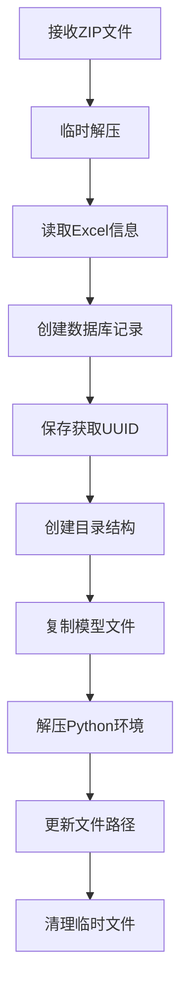

# 模型管理系统技术文档

## 1. 系统概述

模型管理系统是一个完整的机器学习模型生命周期管理平台，负责模型的上传、存储、信息管理、文件组织和运行环境配置。系统采用MVC架构设计，包含数据模型层、服务层和API路由层，实现了以下核心功能：

- 模型上传与解析
- 模型信息存储与管理
- 模型文件组织与版本控制
- Python环境的安全解压与配置
- 模型的查询与检索
- 模型的删除和资源清理

## 2. 数据库结构

### 2.1 模型基础信息表 (ModelInfo)

```python
class ModelInfo(db.Model):
    uuid = db.Column(db.String(37), primary_key=True, default=generate_model_uuid)
    name = db.Column(db.String(100), nullable=False, comment='模型名称')
    task_type = db.Column(db.Integer, nullable=False, comment='模型任务(1-4)')
    output_type = db.Column(db.String(100), nullable=False, comment='模型输出')
    model_category = db.Column(db.String(50), nullable=False, comment='模型类别')
    application_scenario = db.Column(db.String(50), nullable=False, comment='应用场景')
    test_data_count = db.Column(db.Integer, nullable=False, comment='测试数据数量')
    training_date = db.Column(db.DateTime, nullable=False, comment='模型训练日期')
    parameter_count = db.Column(db.String(50), nullable=False, comment='模型参数量')
    convergence_time = db.Column(db.String(50), nullable=False, comment='模型收敛时长')
    updated_at = db.Column(db.DateTime, nullable=False, default=datetime.utcnow, 
                          onupdate=datetime.utcnow, comment='更新时间')
    detail = db.relationship('ModelDetail', backref='model', uselist=False, 
                           cascade='all, delete-orphan', single_parent=True)
```

### 2.2 模型详情表 (ModelDetail)

```python
class ModelDetail(db.Model):
    uuid = db.Column(db.String(50), primary_key=True, default=generate_detail_uuid)
    model_uuid = db.Column(db.String(37), db.ForeignKey('model_info.uuid', ondelete='CASCADE'), 
                        nullable=False, unique=True, comment='关联的模型UUID')
    description = db.Column(db.Text, nullable=False, comment='模型简介')
    architecture_image_path = db.Column(db.String(255), comment='模型架构图片路径')
    architecture_text = db.Column(db.Text, nullable=False, comment='模型架构文本')
    feature_design_image_path = db.Column(db.String(255), comment='模型特征设计图片路径')
    feature_design_text = db.Column(db.Text, nullable=False, comment='模型特征设计文本')
    code_file_path = db.Column(db.String(255), comment='模型代码文件路径')
    env_file_path = db.Column(db.String(255), comment='模型环境文件路径')
```

### 2.3 UUID生成机制

系统使用带前缀的UUID来区分不同类型的实体：

```python
# 模型UUID生成（使用"MODEL-"前缀）
def generate_model_uuid():
    return f"MODEL-{uuid.uuid4().hex}"

# 模型详情UUID生成（使用"MODEL_DETAIL-"前缀）
def generate_detail_uuid():
    return f"MODEL_DETAIL-{uuid.uuid4().hex}"
```

## 3. 模型文件系统结构

### 3.1 标准化目录结构

系统对每个模型维护以下标准化的目录结构：

```
STORAGE_FOLDER/
└── MODEL_FOLDER/
    └── <model_uuid>/
        ├── architecture/      # 存储模型架构图
        ├── feature_design/    # 存储特征设计图
        ├── code/              # 存储模型代码
        │   └── main.py        # 主代码文件（必须）
        └── python_env/        # 存储Python环境
```

### 3.2 配置参数

参看config.py

## 4. 模型上传机制

### 4.1 上传包结构要求

模型上传ZIP包必须遵循以下结构：

```
model_upload.zip/
├── model_information.xlsx  # 模型元信息Excel文件
├── model_architecture/     # 模型架构图片
├── model_feature_design/   # 特征设计图片
├── model_code/             # 模型代码
│   └── main.py             # 主要代码文件（必须）
└── model_python_env/       # Python环境
    └── python_env.zip      # 打包的Python环境
```

### 4.2 Excel文件结构要求

`model_information.xlsx`必须包含以下字段：

| 字段名       | 值类型      | 说明                                         |
| ------------ | ----------- | -------------------------------------------- |
| 模型名称     | 字符串      | 模型的显示名称                               |
| 模型任务     | 整数(1-4)   | 1:路径损耗, 2:覆盖图, 3:功率延时, 4:多点传播 |
| 模型输出     | 字符串      | 模型输出类型的描述                           |
| 模型类别     | 字符串      | 如"神经网络"、"随机森林"等                   |
| 应用场景     | 字符串      | 如"无线通信"、"图像识别"等                   |
| 模型训练时间 | 日期        | 模型训练的日期                               |
| 模型参数量   | 字符串/数字 | 模型的参数数量                               |
| 模型收敛时长 | 字符串/数字 | 训练时长（小时）                             |
| 模型简介     | 字符串      | 模型的详细描述                               |
| 模型特征设计 | 字符串      | 模型特征工程的描述                           |

### 4.3 上传处理流程



### 4.4 日期处理机制

系统能够处理多种日期格式：

```python
# 如果日期为空，使用当前时间
if pd.isna(value):
    value = datetime.now()
# 如果是Excel序列号，转换为datetime
elif isinstance(value, (int, float)):
    value = pd.Timestamp.fromordinal(int(value) + 693594).to_pydatetime()
# 如果是字符串，尝试解析
elif isinstance(value, str):
    try:
        value = datetime.strptime(value, '%Y年%m月%d日')
    except ValueError:
        value = datetime.now()
```

## 5. 模型服务层功能

### 5.1 模型列表查询

支持分页和多种搜索条件：

```python
def get_model_list(page=1, per_page=10, search_type=None, search_term=None):
    # 创建基础查询
    query = ModelInfo.query
    
    # 使用搜索策略模式应用搜索条件
    if search_type and search_term:
        strategy = search_factory.get_strategy(f"model_{search_type}")
        query = strategy.apply(query, search_term)
    
    # 按更新时间排序
    query = query.order_by(ModelInfo.updated_at.desc())
    
    # 执行分页查询
    pagination = query.paginate(page=page, per_page=per_page, error_out=False)
    
    # 返回标准化的分页结果
    return {
        'total': pagination.total,
        'pages': pagination.pages,
        'current_page': pagination.page,
        'per_page': pagination.per_page,
        'items': [item.to_dict() for item in pagination.items],
        'search_types': [name.replace('model_', '') for name in 
                        search_factory.get_all_strategy_names() 
                        if name.startswith('model_')]
    }
```

### 5.2 模型详情查询

```python
def get_model_detail(model_uuid):
    # 获取模型基础信息
    model = ModelInfo.query.get_or_404(model_uuid)
    model_dict = model.to_dict()
    
    # 获取模型详情
    if model.detail:
        model_dict['detail'] = model.detail.to_dict()
    else:
        model_dict['detail'] = None
        
    return model_dict
```

### 5.3 模型删除与资源清理

包含使用中检查和文件资源清理：

```python
def delete_model(model_uuid):
    # 检查模型是否在使用中
    in_use, error_msg = ModelService.check_model_in_use(model_uuid)
    if in_use:
        raise ValueError(error_msg)
        
    try:
        # 获取模型信息
        model = ModelInfo.query.get_or_404(model_uuid)
        
        # 如果存在详情，先删除相关文件
        if model.detail:
            model.detail.delete_files()
        
        # 删除数据库记录（级联删除会自动删除详情记录）
        db.session.delete(model)
        db.session.commit()
        
        return True
    except Exception as e:
        db.session.rollback()
        raise e
```

### 5.4 文件清理实现

处理不同操作系统的文件删除差异：

```python
def delete_files(self):
    model_folder = get_model_folder_path(self.model_uuid)
    if not os.path.exists(model_folder):
        return
        
    try:
        # 首先尝试使用shutil.rmtree删除
        shutil.rmtree(model_folder, ignore_errors=True)
        
        # 检查文件夹是否还存在
        if os.path.exists(model_folder):
            # 如果还存在，使用系统命令强制删除
            if platform.system() == 'Windows':
                # Windows系统使用rd命令
                subprocess.run(['rd', '/s', '/q', model_folder], 
                            shell=True, 
                            check=False,
                            capture_output=True)
            else:
                # Linux/Unix系统使用rm命令
                subprocess.run(['rm', '-rf', model_folder], 
                            shell=False, 
                            check=False,
                            capture_output=True)
    except Exception as e:
        current_app.logger.error(
            f"删除文件夹 {model_folder} 时发生错误: {str(e)}"
        )
```

## 6. API接口规范

### 6.1 模型上传接口

```
POST /model/upload
Content-Type: multipart/form-data

参数:
- model_package: 模型ZIP包文件

成功响应: (200 OK)
{
  "code": 200,
  "message": "模型上传成功",
  "data": {
    "model_uuid": "MODEL-abcdef1234567890"
  }
}

错误响应: (400/500)
{
  "code": 400或500,
  "message": "错误信息",
  "data": null
}
```

### 6.2 模型列表接口

```
GET /model/list?page=1&per_page=10&search_type=name&search_term=关键词

参数:
- page: 页码，默认1
- per_page: 每页条数，默认10
- search_type: 搜索类型（可选）
- search_term: 搜索关键词（可选）

成功响应: (200 OK)
{
  "code": 200,
  "message": "获取成功",
  "data": {
    "total": 100,
    "pages": 10,
    "current_page": 1,
    "per_page": 10,
    "items": [
      {
        "uuid": "MODEL-abcdef1234567890",
        "name": "模型名称",
        "task_type": 1,
        "output_type": "路径损耗预测",
        ...
      },
      ...
    ],
    "search_types": ["name", "category", "scenario"]
  }
}
```

### 6.3 模型详情接口

```
GET /model/<model_uuid>

成功响应: (200 OK)
{
  "code": 200,
  "message": "获取成功",
  "data": {
    "uuid": "MODEL-abcdef1234567890",
    "name": "模型名称",
    "task_type": 1,
    ...
    "detail": {
      "uuid": "MODEL_DETAIL-1234567890abcdef",
      "description": "模型简介",
      "architecture_image_path": "models/MODEL-abcdef1234567890/architecture/image.png",
      ...
    }
  }
}
```

### 6.4 模型删除接口

```
DELETE /model/<model_uuid>

成功响应: (200 OK)
{
  "code": 200,
  "message": "删除成功",
  "data": null
}

错误响应:
{
  "code": 500,
  "message": "删除模型失败：该模型正在被验证任务使用，无法删除",
  "data": null
}
```

## 7. 安全解压器集成

### 7.1 Python环境解压

使用`SafeExtractor`确保多线程安全解压：

```python
def _extract_python_env(source_path, model_uuid):
    env_zip = os.path.join(source_path, 'model_python_env', 'python_env.zip')
    if os.path.exists(env_zip):
        env_dst = os.path.join(
            current_app.config['STORAGE_FOLDER'],
            current_app.config['MODEL_FOLDER'],
            model_uuid,
            current_app.config['MODEL_PYTHON_ENV_FOLDER']
        )
        # 使用安全解压器解压Python环境
        extractor = SafeExtractor(env_zip, env_dst)
        if not extractor.extract_all():
            raise Exception("Python环境解压失败")
```

## 8. 错误处理与异常管理

### 8.1 事务管理

所有数据库操作使用事务包装，确保原子性：

```python
try:
    # 数据库操作
    db.session.add(model)
    db.session.commit()
except Exception as e:
    db.session.rollback()
    # 清理已创建的资源
    raise e
```

### 8.2 资源清理机制

使用finally块确保临时资源清理：

```python
try:
    # 处理逻辑
except Exception as e:
    # 错误处理
    raise e
finally:
    # 清理临时文件
    if os.path.exists(temp_extract_path):
        shutil.rmtree(temp_extract_path, ignore_errors=True)
```

### 8.3 服务器统一响应格式

使用`ServerResponse`确保API返回格式一致：

```python
return jsonify(
    ServerResponse.success(
        data={'model_uuid': model_uuid},
        message='模型上传成功'
    ).model_dump()
), HTTPStatus.OK.value

# 错误响应
return jsonify(
    ServerResponse.error(
        f"模型上传失败：{str(e)}", 
        HTTPStatus.INTERNAL_SERVER_ERROR.value
    ).model_dump()
), HTTPStatus.INTERNAL_SERVER_ERROR.value
```

## 9. 实际使用流程

### 9.1 模型上传流程

1. 准备符合结构要求的模型ZIP包
2. 调用`POST /model/upload`接口上传模型
3. 系统解压、解析Excel信息、创建数据库记录
4. 将模型文件组织到标准化目录结构
5. 解压并配置Python环境
6. 返回`model_uuid`供后续操作使用

### 9.2 模型查询流程

1. 调用`GET /model/list`接口获取模型列表
2. 可选使用分页参数和搜索条件过滤
3. 调用`GET /model/<model_uuid>`获取特定模型详情

### 9.3 模型删除流程

1. 调用`DELETE /model/<model_uuid>`请求删除特定模型
2. 系统检查模型是否在使用中（有运行中的评估任务）
3. 如未使用，删除文件系统资源和数据库记录
4. 如在使用中，返回错误信息

## 10. 技术依赖与版本要求

- **Python**: 3.6+
- **Flask**: 2.0.0+
- **SQLAlchemy**: 1.4.0+
- **Pandas**: 1.0.0+，用于Excel解析
- **Pydantic**: 1.8.0+，用于请求/响应验证
- **依赖Python模块**:
  - `os`, `shutil`, `zipfile`, `platform`
  - `subprocess`, `datetime`, `uuid`
  - `concurrent.futures`（用于SafeExtractor）
  - `threading`（用于SafeExtractor）

## 11. 注意事项与限制

1. **Excel格式要求严格**: 模型信息Excel必须包含所有规定字段，且列名必须为"字段名"和"值"
2. **Python环境兼容性**: 解压后的Python环境需与服务器操作系统兼容
3. **模型文件唯一性**: 每个模型在系统中必须使用唯一UUID标识
4. **模型删除限制**: 正在被评估任务使用的模型无法删除
5. **文件路径长度限制**: 存储路径不应超过操作系统限制（Windows: 260字符）
6. **存储空间管理**: 应定期监控存储空间使用情况，防止磁盘空间耗尽